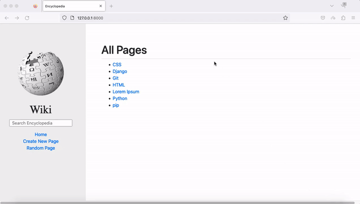
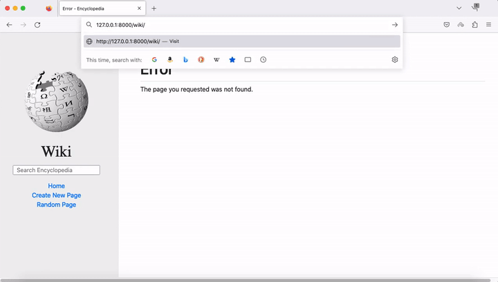
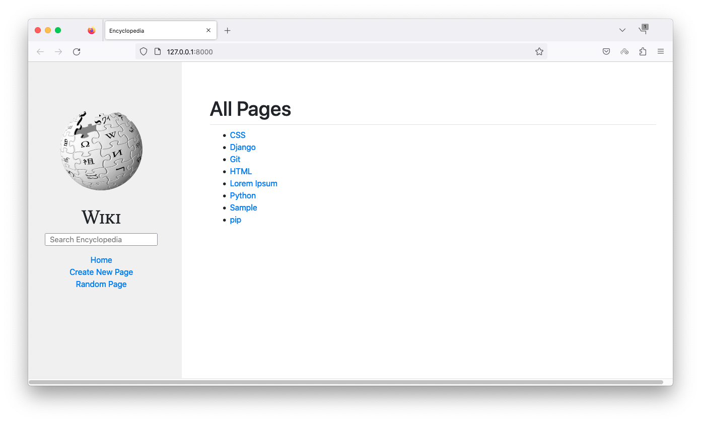
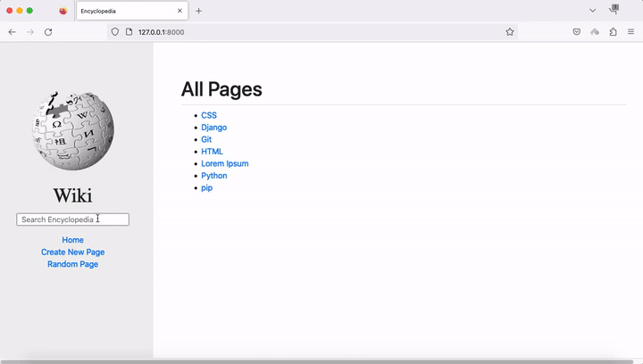
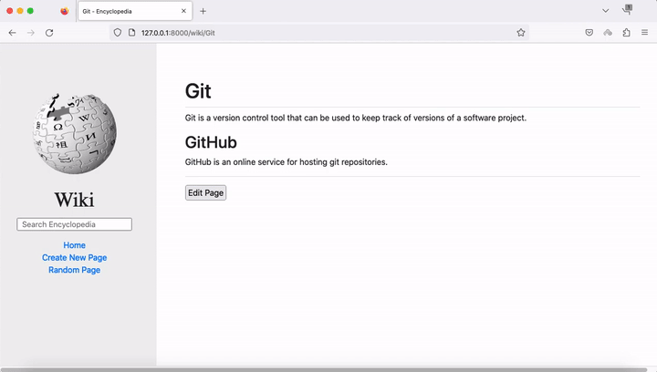
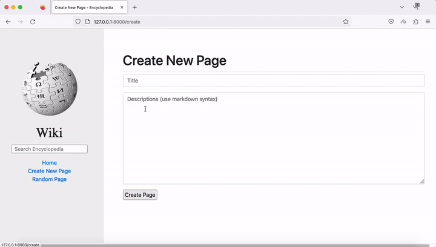
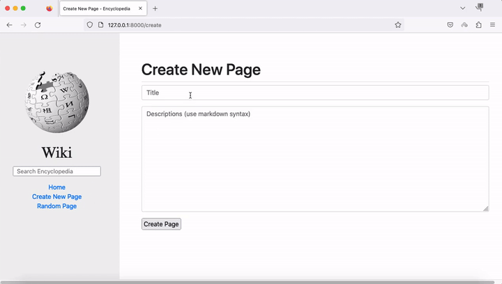
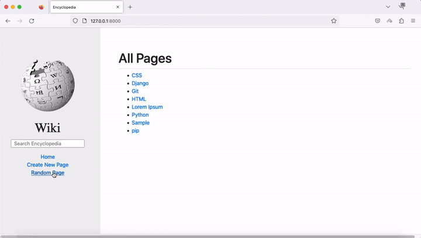

# Wiki
### [Video Demo](https://www.youtube.com/watch?v=h28xO9zp7-o)
### Description: A Wikipedia-like online encyclopedia built with Django.

# Specification
1. Entry Page: In the address bar, visiting /wiki/TITLE (where TITLE is the title of an encyclopedia entry) should render a page that displays the contents of that encyclopedia entry.
    - If an entry is requested that does not exist, the user should be presented with an error page indicating that their requested page was not found:
    - 
    - If the entry does exist, the user should be presented with a page that displays the content of the entry. The title of the page should include the name of the entry:
    - 
  

2. Index Page: Update index.html so that user can click on any entry name to be taken directly to that entry page.

3. Search: Allow the user to type a query into the search box in the sidebar to search for an encyclopedia entry.
    - If the query matches the name of an encyclopedia entry, the user should be redirected to that entry’s page.
    - 
    - If the query does not match the name of an encyclopedia entry, the user should instead be taken to a search results page that displays a list of all encyclopedia entries that have the query as a substring. For example, if the search query were ytho, then Python should appear in the search results.
    - 
    - Clicking on any of the entry names on the search results page should take the user to that entry’s page.
  

3. New Page: Clicking “Create New Page” in the sidebar should take the user to a page where they can create a new encyclopedia entry.
    - When the page is saved, if an encyclopedia entry already exists with the provided title, the user should be presented with an error message.
    - 
    - Otherwise, the encyclopedia entry should be saved to disk, and the user should be taken to the new entry’s page.
    - 
  

4. Edit Page: On each entry page, the user should be able to click a link to be taken to a page where the user can edit that entry’s Markdown content in a textarea. The textarea should be pre-populated with the existing Markdown content of the page, and the user should be able to click a button to save the changes made to the entry. Once the entry is saved, the user should be redirected back to that entry’s page.

5. Random Page: Clicking “Random Page” in the sidebar should take user to a random encyclopedia entry.
